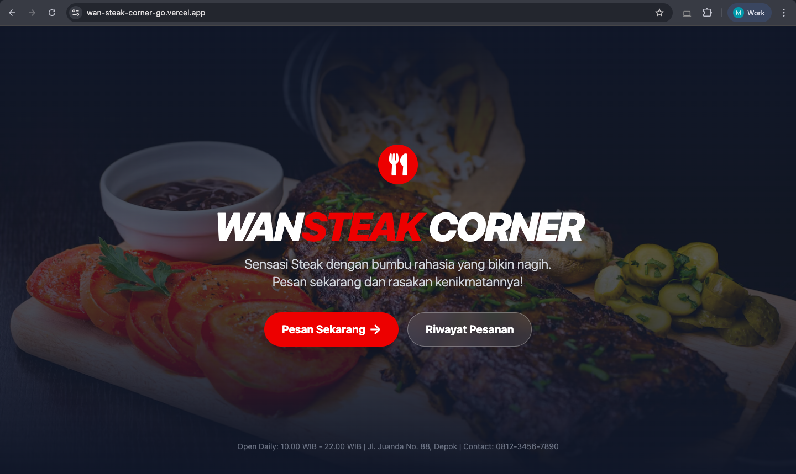
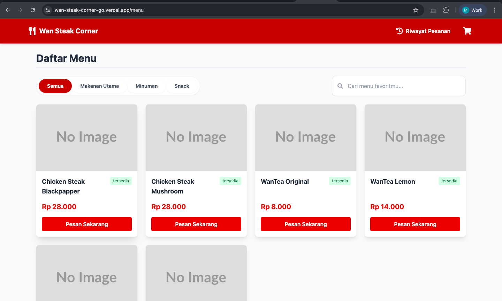
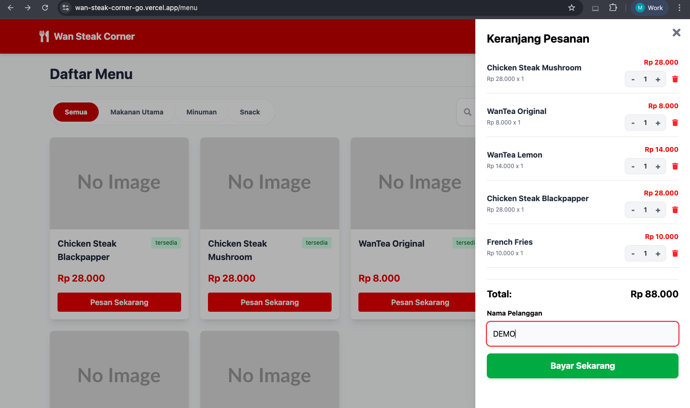
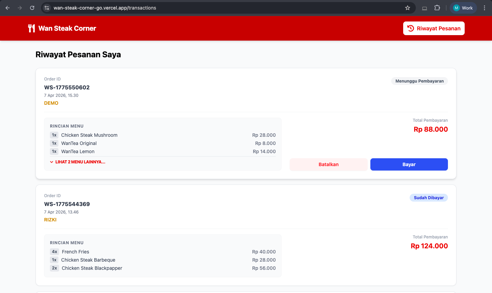
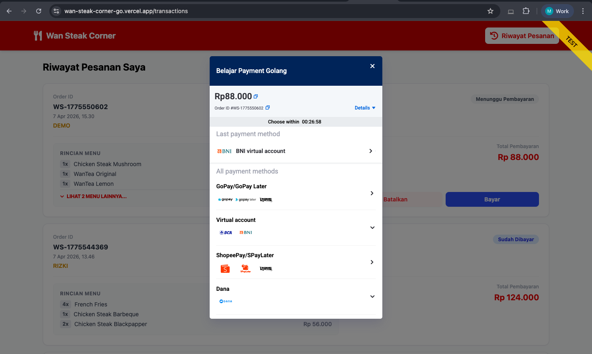
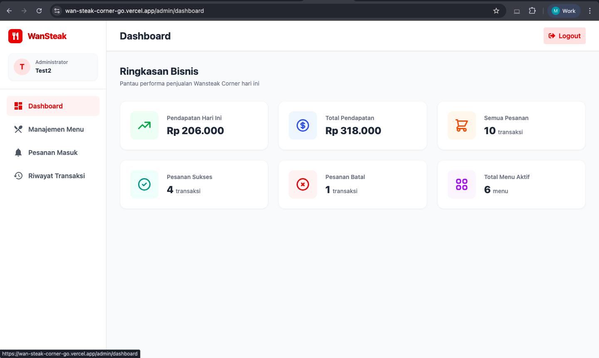
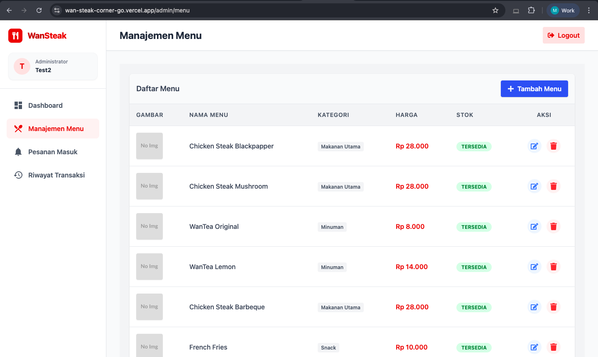
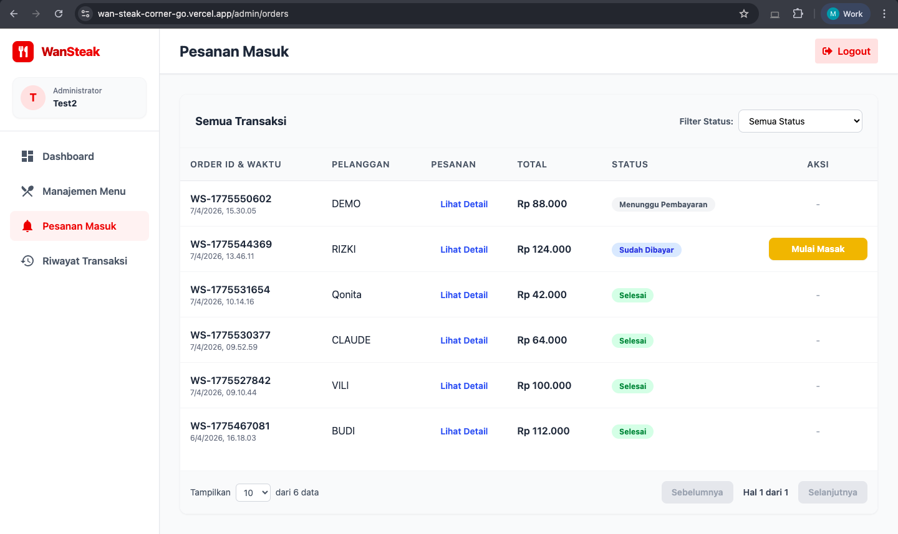
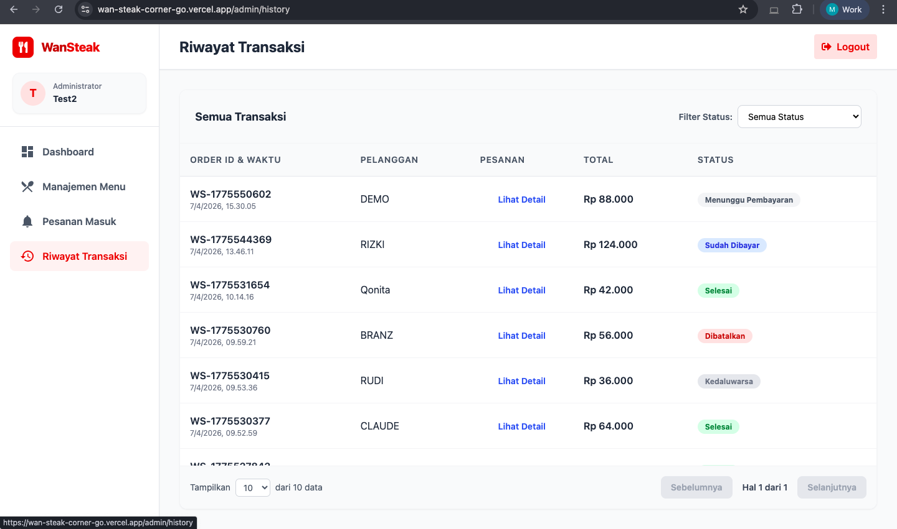

# 🥩 Wan Steak Corner - Kiosk & POS System

🌐 **Live Demo:** [https://wan-steak-corner-7dejbh52u.vercel.app/](https://wan-steak-corner-7dejbh52u.vercel.app/)

Wan Steak Corner adalah aplikasi sistem pemesanan bergaya Kiosk dan *Point of Sales* (POS) berbasis Web. Aplikasi ini memungkinkan pelanggan untuk menelusuri menu, memfilter kategori, mencari makanan, dan melakukan pemesanan (Checkout). Selain itu, terdapat sisi Admin untuk mengelola data menu secara dinamis.


## 📸 Galeri Antarmuka (Screenshots)

Berikut adalah tampilan antarmuka dari aplikasi Wan Steak Corner:

### Sisi Pelanggan (Customer View)
<br>

**1. Landing Page**


**2. Katalog Menu & Pemesanan**


**3. Keranjang Pesanan**


**4. Riwayat & Status Transaksi**


**5. Snap Midtrans (Payment)**


---

### Sisi Administrator (Admin View)
<br>

**6. Dasbor Ringkasan Bisnis**


**7. Manajemen Menu (CRUD)**


**8. Pesanan Masuk**


**9. Riwayat Transaksi**


---

## 🚀 Tech Stack

**Frontend:**
* React.js (Vite)
* Tailwind CSS (Styling)
* React Router DOM (Navigasi)
* React Icons & React Hot Toast (UI/UX)

**Backend:**
* Golang (Go)
* GORM (ORM Library)
* PostgreSQL (Database)

---

## 📂 Struktur Folder Proyek

Aplikasi ini dipisahkan secara tegas antara sisi *Client* (Frontend) dan *Server* (Backend) untuk memudahkan skalabilitas dan *maintenance*.

```text
wansteakcorner/
│
├── wansteak-server/         # API Server (Golang)
│   ├── config/              # Konfigurasi koneksi Database & Env
│   ├── controllers/         # Handler/Logika penanganan request & response API
│   ├── middleware/          # Middleware (Auth JWT, CORS, dll)
│   ├── models/              # Struktur data GORM (Entity/Tabel Database)
│   ├── repository/          # Layer akses data (Query ke Database)
│   ├── routes/              # Pendaftaran endpoint URL API
│   ├── usecase/             # Layer business logic / logika inti aplikasi
│   ├── .env                 # Variabel environment rahasia (Tidak di-push ke Git)
│   ├── .env.example         # Template variabel environment untuk local dev
│   ├── go.mod               # Manajemen dependensi Go
│   ├── go.sum               # Checksum dependensi Go
│   └── main.go              # Entry point server Golang
│
├── wansteak-client/         # Client Application (React + Vite)
│   ├── public/              # Aset statis public
│   ├── src/                 # Source code utama React
│   │   ├── assets/          # File gambar statis, icon, dll
│   │   ├── components/      # Komponen UI reusable (Navbar, MenuCard, dll)
│   │   ├── hooks/           # Custom React hooks
│   │   ├── pages/           # Komponen level halaman (Home, Admin, Transactions)
│   │   ├── services/        # Konfigurasi Axios & pemanggilan API backend
│   │   ├── utils/           # Fungsi helper/utility (format harga, tanggal, dll)
│   │   ├── App.jsx          # Konfigurasi routing utama dengan React Router
│   │   ├── main.jsx         # Entry point aplikasi React
│   │   └── index.css        # File CSS utama (Konfigurasi Tailwind)
│   ├── index.html           # Template HTML utama aplikasi
│   ├── package.json         # Manajemen dependensi NPM (Node.js)
│   ├── tailwind.config.js   # Konfigurasi styling, warna, dan tema Tailwind
│   ├── vercel.json          # Konfigurasi routing rewrite SPA untuk deployment Vercel
│   └── vite.config.js       # Konfigurasi bundler Vite
│
├── .gitignore               # Daftar file/folder yang diabaikan oleh Git
└── README.md                # Dokumentasi utama proyek

```
---

## ✨ Fitur Utama

### 🧑‍🍳 Sisi Pelanggan (Customer)
* **Landing Page Premium:** Sambutan visual bergaya Kiosk modern.
* **Katalog Menu Interaktif:** Dilengkapi *Search Bar* ganda dan *Pill Tabs* untuk filter kategori (Makanan Utama, Minuman, Snack).
* **Keranjang Pintar (Smart Cart):** Manajemen *quantity* (`+`/`-`) dengan auto-hapus jika *quantity* mencapai nol.
* **Checkout & Riwayat Pesanan:** Melacak pesanan pelanggan dengan UI *Accordion* untuk pesanan berjumlah besar.

### 🔐 Sisi Admin
* **Manajemen Menu (CRUD):** Tambah, Edit, dan Hapus menu beserta stok dan kategori.
* **Keamanan:** Autentikasi berbasis token (JWT) untuk akses *Dashboard*.
* *(Upcoming)*: Dashboard Statistik & Export CSV.

---

## 🛠️ Cara Menjalankan di Local (Local Development)

Pastikan sudah menginstal **Node.js**, **Golang**, dan **PostgreSQL** di komputer.

### 1. Setup Database
1. Buka PostgreSQL (via pgAdmin / psql / TablePlus).
2. Buat database baru bernama `wansteak_db`.

### 2. Setup Backend (Go)
1. Buka terminal, masuk ke folder backend.
2. Buat file `.env` (atau salin dari `.env.example`) di *root* folder backend dan isi dengan konfigurasi database dan Midtrans Sandbox Anda:
   ```env
        DB_HOST=localhost
        DB_USER=postgres
        DB_PASSWORD=password_db_anda
        DB_NAME=wansteak_db
        DB_PORT=5432
        JWT_SECRET=rahasia_super_aman

        MIDTRANS_SERVER_KEY=
        MIDTRANS_CLIENT_KEY=
        MIDTRANS_ENVIRONMENT=sandbox
   ```
1. Jalankan perintah instalasi dan jalankan server:
    ```bash
        # Windows & macOS sama  
        go mod tidy
        go run main.go
    ```
   Catatan: GORM akan otomatis melakukan migrasi tabel ke database Anda.
2. Ekspos API dengan Ngrok .
   Agar Midtrans dan frontend bisa berkomunikasi dengan backend secara online tanpa kendala IP, gunakan domain statis Ngrok yang sudah dikonfigurasi. Buka terminal baru dan jalankan:
   ```bash
   ngrok http --domain=domain-statis-anda.ngrok-free.app 8080
   ```
   (Pastikan mengganti domain-statis-anda dengan domain yang terdaftar di akun Ngrok Anda, dan pastikan port 8080 sesuai dengan port server Go).
   
### 3. Setup Frontend (React)
1. Buka terminal baru, masuk ke folder frontend
2. Install dependencies:
   ```bash
   npm install
   ```
3. (Opsional) Jika endpoint API backend bukan di `http://localhost:8080`, sesuaikan di file `src/services/api.js`.
4. Jalankan development server:
   ```bash
   npm run dev
   ```

---

## 🌐 Deployment (Production)

Aplikasi Wan Steak Corner menggunakan arsitektur *Cloud* modern untuk memastikan performa yang cepat, aman, dan dapat diakses 24/7 secara gratis. Berikut url aplikasi: https://wan-steak-corner-7dejbh52u.vercel.app/

**Cloud Tech Stack:**
* **Database:** Supabase (PostgreSQL)
* **Backend API:** Render (Web Service)
* **Frontend Client:** Vercel

### 1. Deployment Database (Supabase)
1. Buat *project* baru di [Supabase](https://supabase.com/).
2. Masuk ke pengaturan **Database** -> **Connection Pooling**.
3. Gunakan mode **Session Pooler** (IPv4) untuk menghindari masalah *no route to host* (IPv6) pada beberapa *provider* internet lokal.
4. **Penting:** Pastikan mengubah mode SSL pada konfigurasi koneksi Golang menjadi `sslmode=require` agar autentikasi tidak ditolak oleh Supabase.

### 2. Deployment Backend (Render)
1. Hubungkan repositori GitHub ke [Render](https://render.com/) dengan memilih **New Web Service**.
2. Pada bagian pengaturan, set **Root Directory** ke `wansteak-server`.
3. Masukkan *Build Command*: `go build -o main .` dan *Start Command*: `./main`.
4. Masukkan semua *Environment Variables* di *dashboard* Render.
   * **Optimasi Produksi:** Tambahkan variabel `GIN_MODE=release` untuk mematikan mode *debug*. Ini akan meningkatkan kecepatan respons API dan mengamankan log terminal dari kebocoran struktur *endpoint*.
   * Pastikan URL *Webhook* Midtrans di- *update* ke URL Render ini (`https://[app-name].onrender.com/api/webhook`).

### 3. Deployment Frontend (Vercel)
1. Sebelum *deploy*, pastikan `baseURL` axios di aplikasi React (`src/services/api.js`) sudah diubah mengarah ke URL *Backend* Render Anda.
2. Karena React adalah *Single Page Application* (SPA), tambahkan file `vercel.json` di dalam *root folder* `wansteak-client` untuk mencegah *Error 404 Not Found* saat pengguna melakukan *refresh* halaman:
   ```json
   {
     "rewrites": [
       {
         "source": "/(.*)",
         "destination": "/index.html"
       }
     ]
   }
   ```
3. Hubungkan repositori ke Vercel dan pastikan mengatur Root Directory ke wansteak-client.
4. Klik Deploy dan aplikasi siap digunakan!